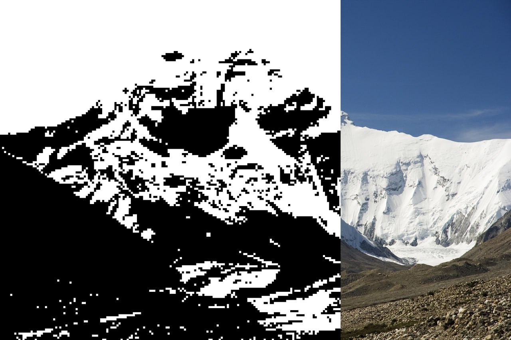

# p1x - CLI tool for (some kind of) digital art image & video processing writen in Go

Goal - Implement as many different tools for working with images and videos as possible

Motivation - the author's personal love for various types of "digital art" and various "lo-fi" effects in digital design, nothing more 🙂

All available CLI tools can be found by calling the `-h` flag.

Examples (GIF & VID processing in progress):

<video src="assets/vid1.mp4" controls width="600"></video>
